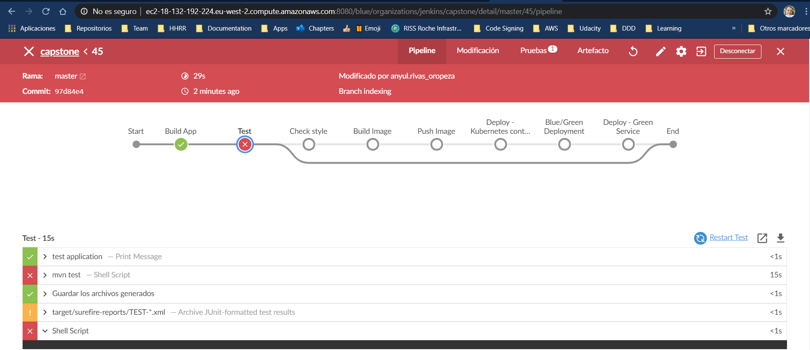
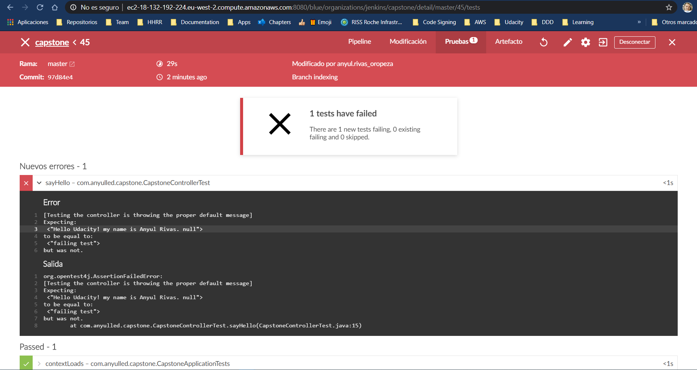
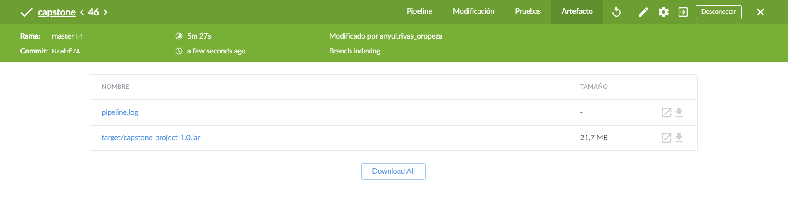
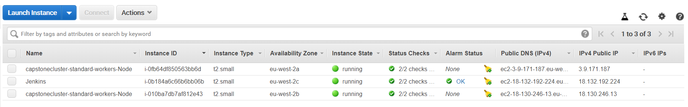
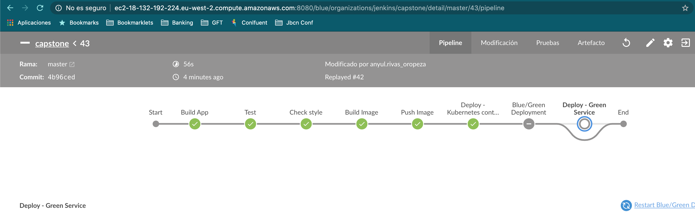
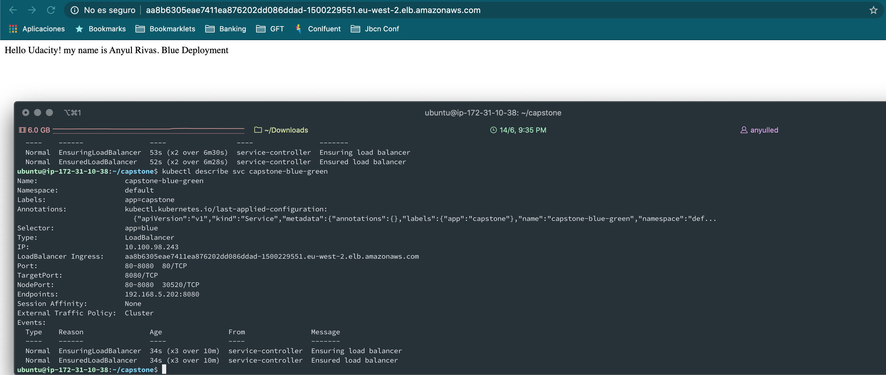
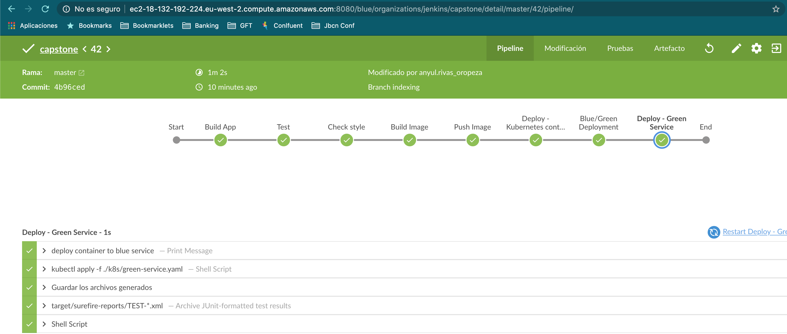

# Capstone Project - Udacity DevOps Nanodegree 

## Steps in Completing Your Project
### Step 1: Propose and Scope the Project
- [x] For the Docker application you can either use an application which you come up with, or use an open-source application pulled from the Internet, or if you have no idea, you can use an Nginx “Hello World, my name is (student name)” application. 

*Configured a Java application under the `src` folder.*
- [x] Pick a deployment type - either rolling deployment or blue/green deployment.

*Blue/green has been chosen as a deployment strategy.*
- [x] Use Jenkins. [Jenkins Server creation instructions here](cloudformation/create-jenkins.md)
- [x] Decide which options you will include in your Continuous Integration phase.

The Jenkins pipeline will perform the following operations:
* Compile the application.
* Execute tests.
* Perform linting via the checkstyle plugin.
* Build a docker image.
* Push the docker image to the docker registry.
* Deploy the container to kubernetes on blue and/or green service. 
- [x] Plan what your pipeline will look like.

### Step 2: Use Jenkins, and implement blue/green or rolling deployment. 

[Instructions here](cloudformation/create-jenkins.md)
- [x] Create your Jenkins master box with either Jenkins and install the plugins you will need.
- [x] Set up your environment to which you will deploy code.

### Step 3: Pick AWS Kubernetes as a Service, or build your own Kubernetes cluster.
- [x] Use Ansible or CloudFormation to build your “infrastructure”; i.e., the Kubernetes Cluster.
- [x] It should create the EC2 instances (if you are building your own), set the correct networking settings, and deploy software to these instances.
- [x] As a final step, the Kubernetes cluster will need to be initialized. The Kubernetes cluster initialization can either be done by hand, or with Ansible/Cloudformation at the student’s discretion.

Using [EKS](https://eu-west-2.console.aws.amazon.com/eks/home?region=eu-west-2#/home) instead of **cloudFormation** or **Ansible**, which will create 2 separate cloudFormation stacks to configure the cluster itself, and the EC2 Instances for the node group.

### Step 4: Build your pipeline
- [x] Construct your pipeline in your GitHub repository. Repository Available [here](https://github.com/anyulled/capstone)
- [x] Set up all the steps that your pipeline will include. See the [Jenkinsfile](Jenkinsfile)
- [x] Configure a deployment pipeline. *See the [Jenkinsfile](Jenkinsfile)*
- [x] Include your Dockerfile/source code in the Git repository. [Dockerfile](Dockerfile)
- [x] Include with your Linting step both a failed Linting screenshot, and a successful Linting screenshot to show the Linter working properly.

I preferred to print test error instead of linting errors, as with Java you get a detailed report on the jenkins job page

### Step 5: Test your pipeline
- [x] Perform builds on your pipeline.

- [x] Verify that your pipeline works as you designed it.
- [x] Take a screenshot of the Jenkins pipeline showing deployment, and a screenshot of your AWS EC2 page showing the newly created (for blue/green) or modified (for rolling) instances. Make sure you name your instances differently between blue and green deployments.

#### EC2 Instances

#### Blue deployment

#### Green deployment

