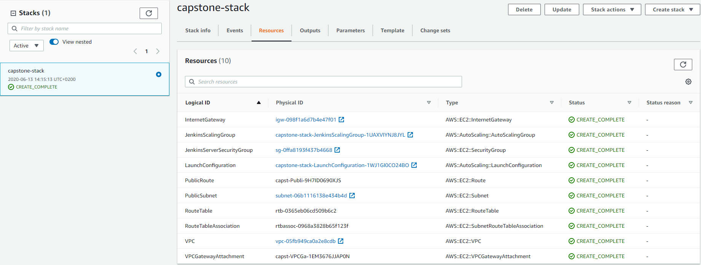
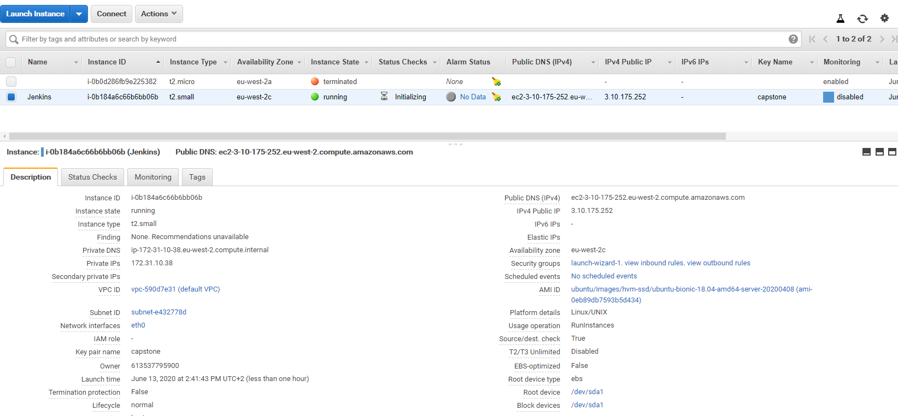
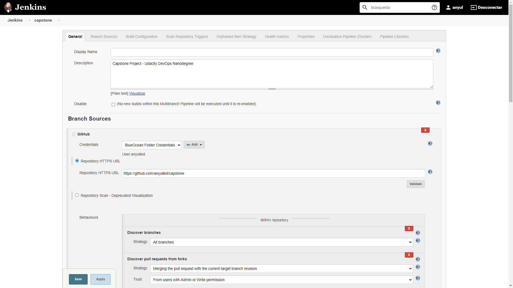
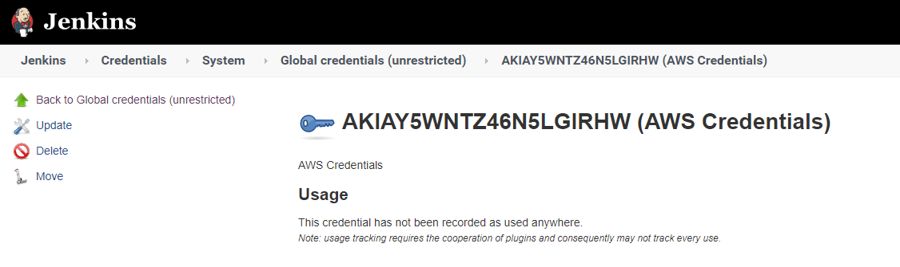
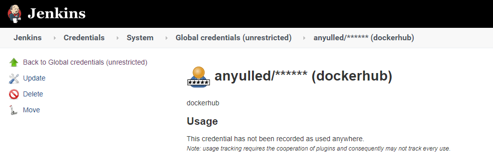

# Creating a Jenkins Server in AWS

In order to configure a Jenkins Server, please run the following script

```shell script
sh ./create-jenkins-server.sh
``` 

It will run a **cloudFormation** script creating a new stack with an auto scaling group with a launch configuration with all the commands necessary to onboard a **Jenkins** server.



Once the stack creation is complete, access the Jenkins server via `http://<EC2_PUBLIC_IP>:8080`



Login using admin account and complete the initial setup of Jenkins.
Install the following plugins in Jenkins:
 -   [CloudBees AWS Credentials](https://plugins.jenkins.io/aws-credentials/)
 -   [Pipeline: AWS Steps](https://plugins.jenkins.io/pipeline-aws/)
 -   [Blue Ocean](https://plugins.jenkins.io/blueocean/)

Create a pipeline using the Blue Ocean plugin, with the following repository
 - [Capstone Project](https://github.com/anyulled/capstone)
 
 

#### Add your **AWS** credentials



#### Add your **Docker** credentials



## Create the EKS Cluster

Configure the `kubectl` context to target the **EKS** Cluster.

connect via ssh to the EC2 instance and run the following scripts:

#### Configure AWS CLI

1. Run `aws configure` and provide your key and secret and set the region to **eu-west-2**

2. Run the following script to create the EKS cluster.

```shell script
eksctl create cluster \
    --name capstonecluster \
    --version 1.14 \
    --nodegroup-name standard-workers \
    --node-type t2.small \
    --nodes 2 \
    --nodes-min 1 \
    --nodes-max 3 \
    --node-ami auto \
    --region eu-west-2 \
    --zones eu-west-2a \
    --zones eu-west-2b \
    --zones eu-west-2c 
```

3. Configure `kubectl`
```shell script
aws eks --region eu-west-2 update-kubeconfig --name capstonecluster
```

Now, the Jenkins server will be listening to new commits on the repository and ready to deploy your app to the Kubernetes cluster on AWS. You can also trigger a manual deploy by clicking on the run icon on the Jenkins pipeline.